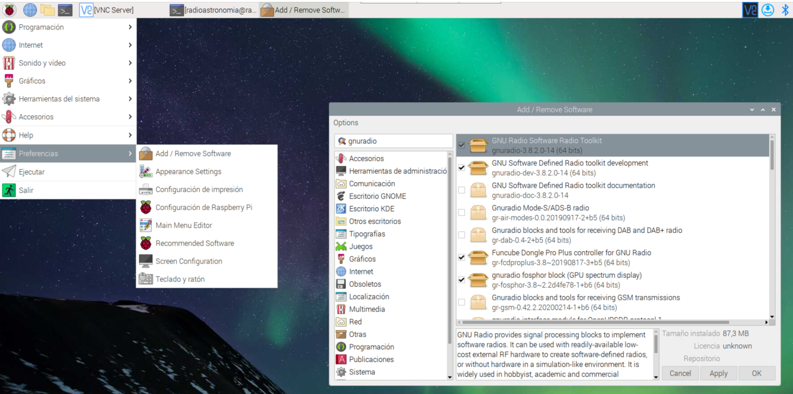

# Instalación GNU-Radio 

En esta pagina podrá encontrar los instaladores de Gnu-Radio para diferentes plataformas con soporte para dispositivos SDR [Repositorio](https://github.com/ryanvolz/radioconda#uhd-ettus-usrp).

## Instalación GNU-Radio Windows 

La instalación de GNU Radio en Windows puede realizarse directamente desde la pagina oficial, aca podrá descargar la [ultima version de GNU-radio](https://github.com/ryanvolz/radioconda/releases/download/2023.07.26/radioconda-2023.07.26-Windows-x86_64.exe). Si desea descargar una version diferente de GNU-Radio podrá encontrarla algunos instaladores binarios de GNU Radio no oficiales que mantiene la comunidad en el siguiente [Repositorio](https://github.com/ryanvolz/radioconda/releases?page=1).


## Instalación GNU-Radio Raspberry PI

GNU-Radio por lo general ya están incluidos en el kernel del sistema operativo de Raspberry PI, de no ser asi puede añadirlo desde, preferencias, add/remove software, busca `gnuradio`. 



También puede instalarlo desde la terminal de raspberry 

```bat
sudo apt-get install -y gnuradio
```
```bat
sudo apt-get install -y gnuradio-dev
```

