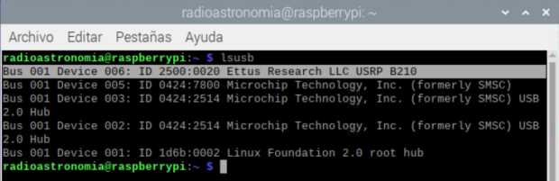
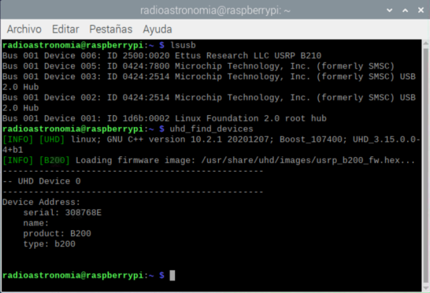
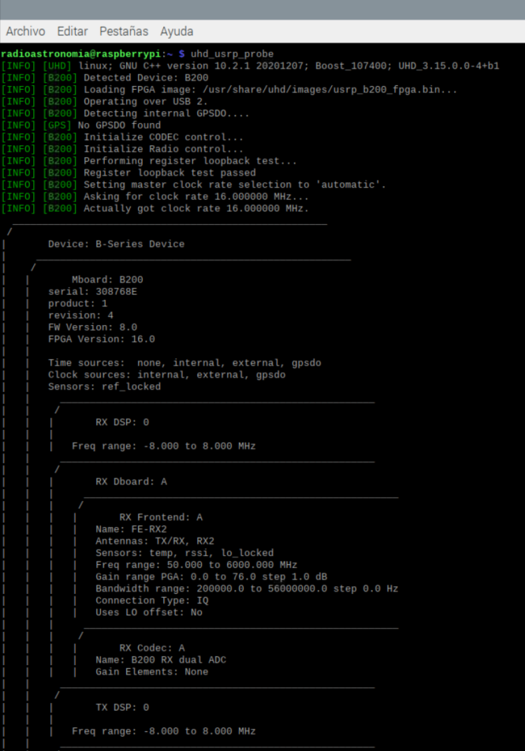
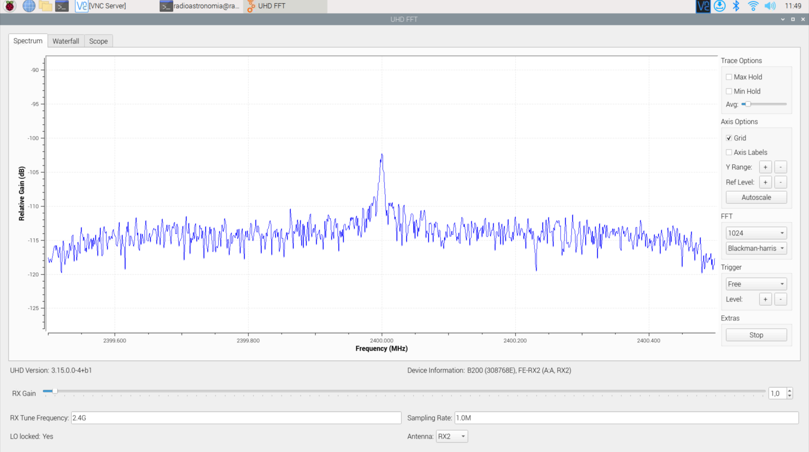

# Instalación en Raspberry PI

En muchos casos, los controladores necesarios para el USRP B200/B210 ya están incluidos en el kernel del sistema operativo de Raspberry PI, por lo que deberían reconocerse automáticamente cuando conecte el dispositivo a la Raspberry Pi. Para verificar si el USRP B200/B210 es reconocido, puedes ejecutar el siguiente comando en la terminal:
 
```bat
lsusb
```



Esto mostrara una lista con los dispositivos USB conectados a la Raspberry Pi, y el USRP B200 debería aparecer en la lista.

Si el dispositivo no es reconocido automáticamente, es posible que necesites instalar los controladores UHD (USRP Hardware Driver). Para ello, sigue los siguientes pasos o consultar la documentación oficial de [ettus](https://kb.ettus.com/Building_and_Installing_the_USRP_Open-Source_Toolchain_(UHD_and_GNU_Radio)_on_Linux):
 
Primero debe actualiza el sistema e instala las herramientas de compilación, instalación de paquetes recomendados:

```bat
sudo apt-get update
```
```bat
sudo apt install python3-matplotlib python3-networkx python3-pyqt5.qwt libeigen3-dev python3-json-pointer python3-rfc3987 python3-uritemplate python3-webcolors python3-pyqt5.qtopengl
```

Crear un directorio en el directorio HOME de Pi donde va a guardar el repositorio UHD clonado desde GitHub.

```bat
mkdir workarea -uhd
```
```bat
cd workarea -uhd
```

Clona el repositorio UHD desde GitHub y accede al directorio.

```bat
git clone https://github.com/EttusResearch/uhd.git
```
```bat
cd uhd
```
Crea otro directorio en host y creación de archivos Cmake.

```bat
cd host
```
```bat
mkdir build
```
```bat
cd build
```
```bat
cmake ../
```
```bat
make
```

Realiza algunas pruebas básicas para verificar que el proceso de compilación se completó correctamente.

```bat
make test
```

Instala UHD.

```bat
sudo make install
```

Actualizar la memoria caché de la biblioteca compartida del sistema.

```bat
sudo ldconfig
```

Cargando e instalación de las imágenes UHD FPGA, esta tarea debería realizado yendo al directorio HOME de Pi

```bat
sudo uhd_image_downloader
```

Configuración de ruta para imágenes.

```bat
export LD_LIBRARY PATH=$LD_LIBRARY_PATH:/usr/local/lib
```

## Verificación del dispositivo USRP 

Puede verificar la conexión e instalación de los controladores de la USRP en el terminal 

```bat
sudo uhd_find_devices
```



Al igual que en windows puede verificar algunas propiedades mas de la USRP con uhd_usrp_probe, esto muestra la versión de firmware y la versión de FPGA que usa USRP.



Adicionalmente en el terminal de Raspberry PI usando el script build-gnu-radio puede utilizar `uhd_fft` este es una herramienta de análisis de espectro muy simple que utiliza un dispositivo UHD conectado para mostrar el espectro en una frecuencia determinada. 

```bat
uhd_fft -f 2.4G
```


Puede encontrar mas herramientas y programas incluidas con GNU-Radio en el siguiente [link](https://wiki.gnuradio.org/index.php/HowToUse)
