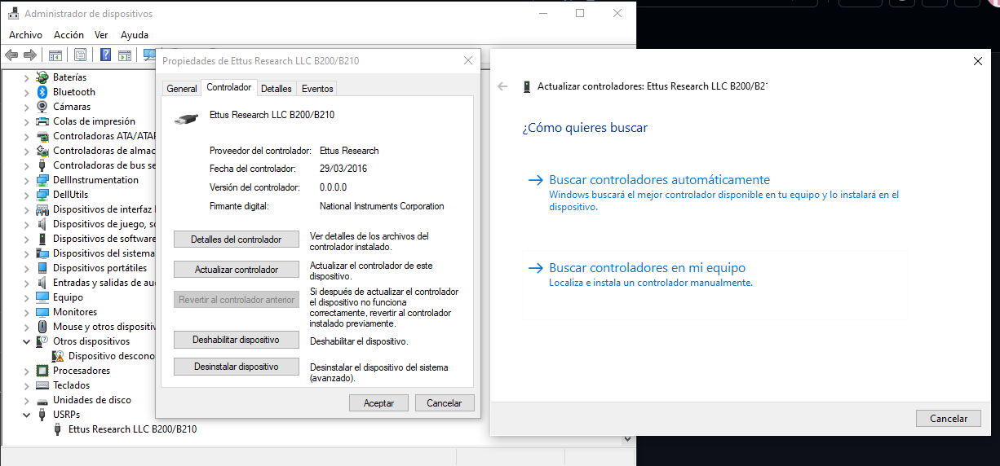

# Instalación en Windows

El primer programa que necesita es el controlador de hardware USRP (UHD) e imágenes de la FPGA. Puede encontrar muchas versiones diferentes de los UHD-binarios con el siguiente enlace [files.ettus](https://files.ettus.com/binaries/uhd/latest_release/4.6.0.0/), diríjase a la carpeta `Windows-10-x64` y descargue el ejecutable


Abra el instalador, asegúrese de seleccionar `Add UHD to the system PATH` y continue con la Instalación.


Luego debe descargar e instalar los controladores [USB UHD](https://files.ettus.com/binaries/misc/) deberá descargar el [erllc_uhd_winusb_driver.zip](https://files.ettus.com/binaries/misc/erllc_uhd_winusb_driver.zip). Deberá añadir el controlador en administrador de dispositivos, selecciona agregar controladores o se dirige a USRP, actualizar controlador. 



Una vez instalado, en el símbolo de sistema use `uhd_find_devices` debe salirle:

```cmd
uhd_find_devices
```


Si al ejecutar `uhd_find_devices`, aparece un mensaje de error que indica que libusb-1.0.dll no se puede encontrar en su sistema, puede descargarlo aquí: [libusb-1.0.dll ](https://www.dll-files.com/libusb-1.0.dll.html)


Después de descargar libusb-1.0.dll, debe copiar el archivo dll en la carpeta `UHD\bin`. La ruta a la carpeta UHD debe ser `C:\Program Files\UHD\bin`, si sigue presentando el error cargue este mismo archivo a la ruta System32 esta debe ser `C:\Windows\System32`.

También debe copiar uhd.dll en la carpeta System32. Puede encontrar uhd.dll en `C:\Program Files\UHD\bin`, 


## Prueba de conexión USRP

Puede verificar la conexión de la USRP con Windows-Terminal presionando la "tecla de Windows" y la "R" al mismo tiempo. Se abrirá la ventana de ejecución. Escriba "cmd" y presiona Enter use nuevamente `uhd_find_devices` para verificar que el PC puede encontrar la USRP.

```cmd
uhd_find_devices
```

También puede verificar algunas propiedades mas de la USRP con `uhd_usrp_probe`, esto muestra la versión de firmware y la versión de FPGA que usa USRP. También muestra la interfaz RX y TX y la placa secundaria.

```cmd
uhd_usrp_probe
```


En este caso, usamos el USRP B200 con la versión de firmware 8.0 y la versión 16.0 de FPGA. Puede ver el rango de frecuencia de la interfaz RX y TX de 50 MHz a 6 GHz. También muestra el rango de ganancia de 0 a 76,0, el ancho de banda de 200 KHz a 56 MHz.

Aca podrá encontrar los diferentes comandos que puede utilizar [Comandos generales UHD](https://www.mankier.com/package/uhd).
