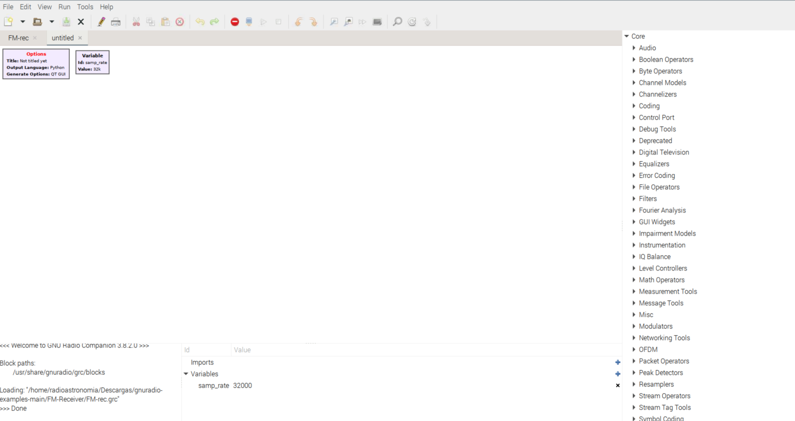
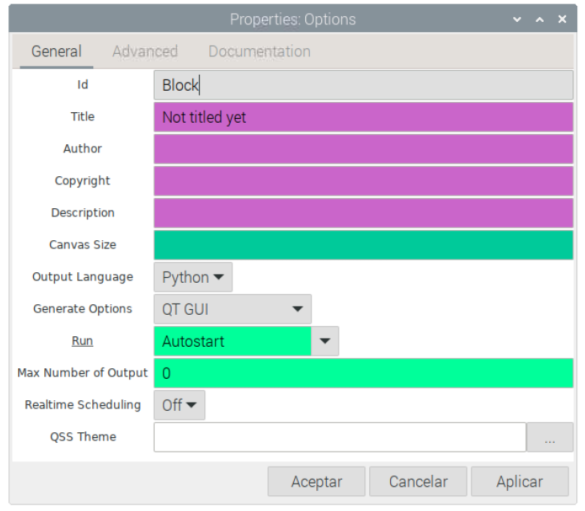
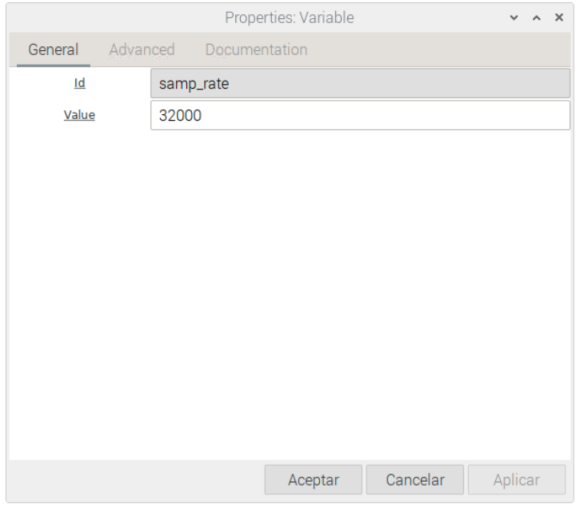
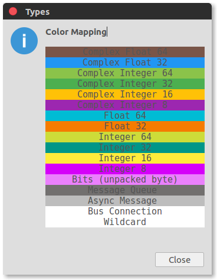
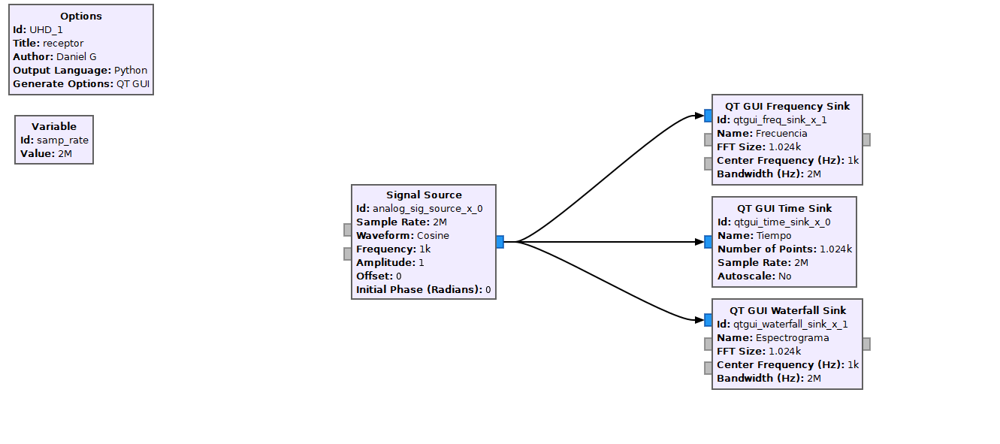
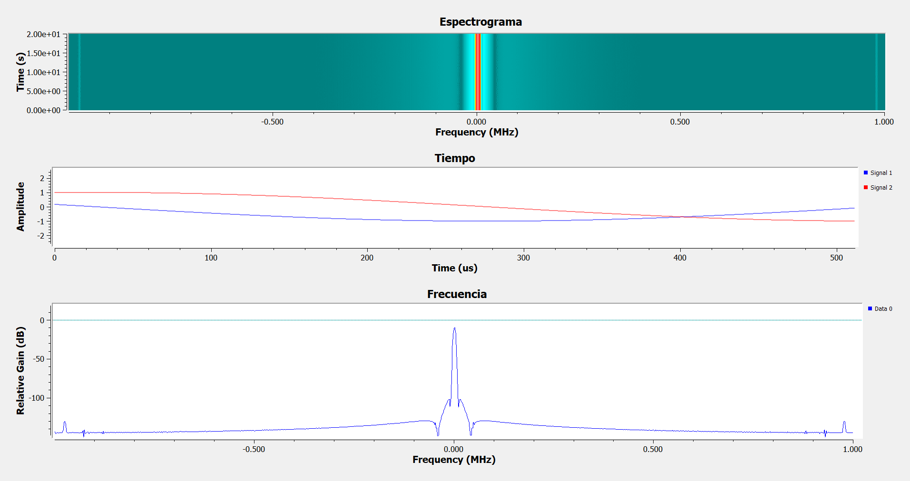

# Primeros pasos 

GNURadio es un paquete de radio definido por software robusto y muy popular. Es de código abierto y es relativamente fácil de usar.
Toda la "codificación" se realiza mediante diagramas de flujo compuestos por bloques de procesamiento de señales digitales interconectados. Los bloques más utilizados vienen predefinidos como parte del paquete de software. También  pueden programar
sus propios bloques. En esta guía encontrara conceptos básicos y estructura de los bloques, tipos de entrada y salida.

Al iniciar un nuevo programa el lienzo se encuentra casi vació, En el lado derecho del lienzo hay una lista de las categorías de bloques que están
disponibles, por defecto encontrara dos bloques `"Options"` y `"Variable"`

El bloque `"Options"` en la parte superior izquierda se utiliza para establecer algunos parámetros generales del diagrama de flujo, como los metadatos del diagrama de flujo, como el título, el autor, etc., la interfaz gráfica de usuario (GUI) para widgets y pantallas de resultados, o el tamaño del lienzo en el que se colocan los bloques. 

El bloque `"Variable"` que se usa para establecer valores a las variables que se usan en todo el diagrama de flujo como la frecuencia de muestreo.

Cuando se trabaja en proyectos, es muy común tener que cambiar los valores durante las pruebas, al igual que en la programación es mejor contar con variables globales, las cuales permite cambiar el valor de ese bloque en todos los valores asignados a ese ID único estos serian reemplazados por el nuevo valor.

## Tipos de datos:

Gnu-Radio cuenta con la capacidad de trabajar con diferentes tipos de datos según necesitemos, el color de un puerto indica el tipo de datos generados para un puerto de salida o el tipo de datos aceptados para una entrada. Los tipos de datos más comunes que utilizaremos son:

- **Azul** para muestras de datos de punto flotante de 32 bits de valor complejo (32 bits para cada parte, real e imaginaria).
- **Naranja** para muestras de datos de punto flotante de 32 bits de valor real
- **Azul-Verde** para muestras de datos enteros de 32 bits (largos) de valor real
- **Amarillo** para muestras de datos enteros (cortos) de 16 bits de valor real
- **Magenta** para muestras de datos enteros de 8 bits (byte) de valor real

## Visualización de datos:

La mayoría de las veces nosotros deseamos ver las gráficas de las señales que estamos adquiriendo y
tratando, Gnu-Radio nos trae una gran cantidad de herramientas distintas y fáciles de utilizar para visualizar
o tener un control visual de las variables que estamos utilizando un proyecto.

Dentro de estos encontramos:

- **QT GUI Frequency Sink:**
Este bloque muestra el espectro de frecuencia de una señal en tiempo real. Visualiza la distribución de energía de la señal en el dominio de la frecuencia. Puede ajustar los parámetros para establecer la frecuencia central, el ancho de banda y la escala de la amplitud.

- **QT GUI Time Sink:**
El bloque QT GUI Time Sink muestra la señal en el dominio del tiempo. Proporciona una vista en tiempo real de la forma de onda de la señal a medida que cambia con el tiempo. Puede ajustar los parámetros para controlar la escala de tiempo y la amplitud. 

- **QT GUI Waterfall Sink:**
El bloque QT GUI Waterfall Sink es similar al QT GUI Frequency Sink, pero en lugar de mostrar el espectro de frecuencia de la señal en un solo gráfico, muestra un "espectrograma" en forma de una representación tridimensional. En el eje vertical se encuentra el tiempo, en el eje horizontal se encuentra la frecuencia y en el eje de profundidad (color o intensidad) se representa la densidad de energía o potencia en esa frecuencia y tiempo específicos.

