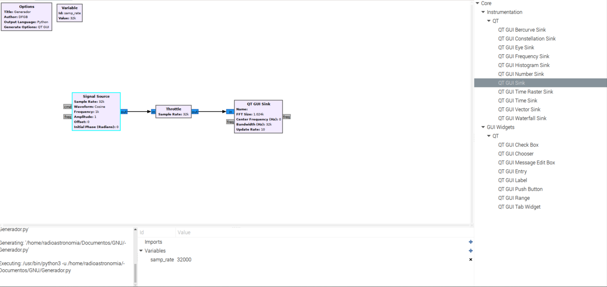
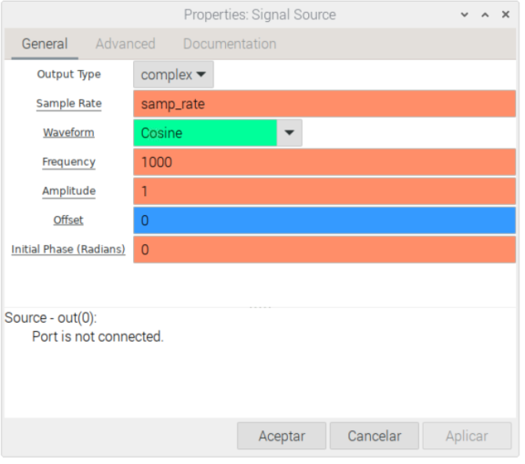
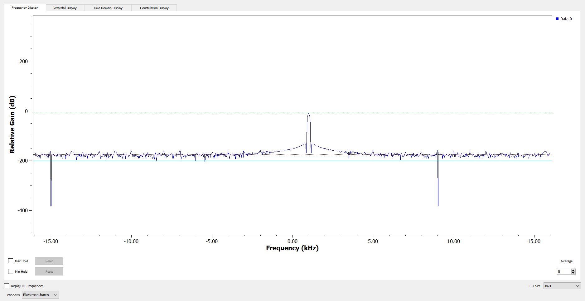

# Ejemplo básico

## Generador forma de onda simple:

El bloque `"Signal Source"` en GNU Radio genera señales de diferentes tipos, como ondas sinusoidales, impulsos, ruido, etc. Esencialmente, proporciona una fuente de señal simulada que puede utilizarse como entrada para experimentos y pruebas en el flujo de procesamiento de GNU Radio.

