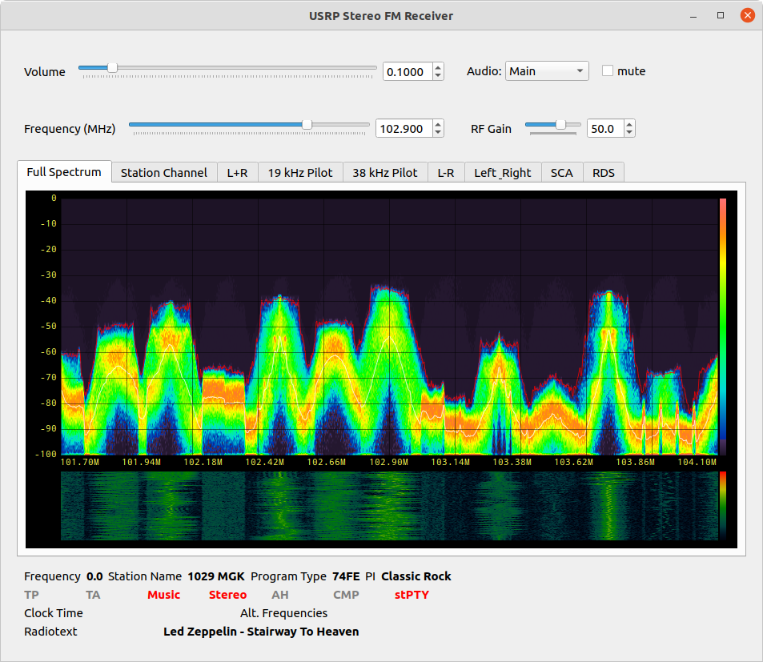
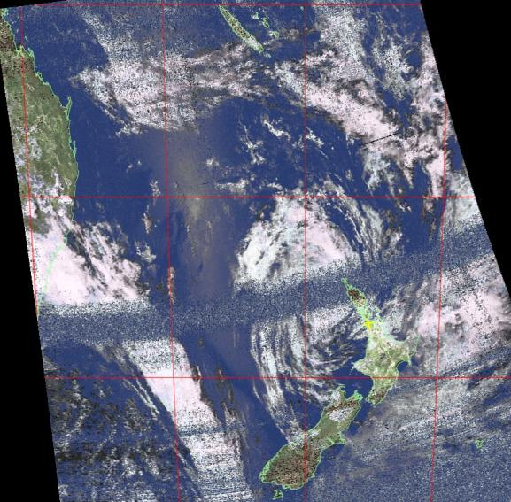
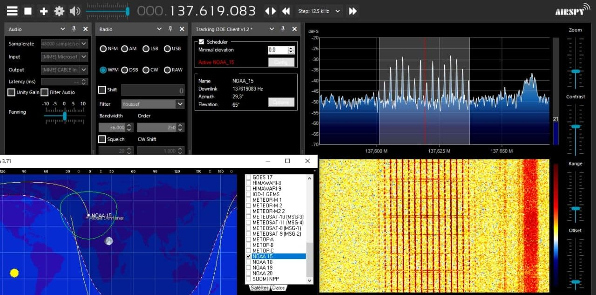
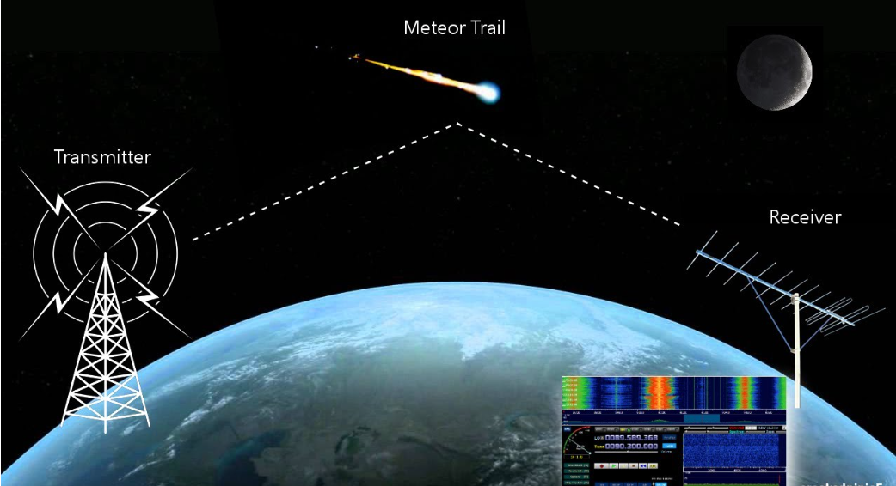

# SDR

Un SDR(Software-Defined Radio), o Radio Definida por Software en español, es un sistema de comunicación que se diferencia de la radio tradicional en dos aspectos fundamentales: El primero de ellos es que la mayor parte de la funcionalidad del SDR es implementada por software en lugar de hardware específico (como se haría en una radio tradicional). Lo anterior le permite a la SDR ganar versatilidad en contraste con lo que hace la radio convencional, en esta ultima los circuitos y componentes electrónicos están diseñados para operar en frecuencias específicas y modos de comunicación. Por otro lado, el segundo aspecto reside en que la SDR al ser un sistema altamente configurable  se adapta a una amplia gama de aplicaciones de comunicación y transmisión y recepción de señales en contraste con el marco de posibilidades que ofrece la radio tradicional en cuanto a la recepción de frecuencias determinadas.

La estructura de un sistema SDR se puede dividir en los siguientes componentes:

- **Tarjeta SDR:** La tarjeta SDR es el componente principal de un sistema SDR. Es responsable de la recepción y transmisión de señales de radio.
- **Software:** El software se utiliza para controlar la tarjeta SDR y procesar las señales de radio.
- **Una antena:** La antena se utiliza para recibir y transmitir señales de radio.
- **Un ordenador o sistema embebido:** El ordenador o sistema embebido se utiliza para procesar las señales de radio.

## Características

- **Conversión Analógico-Digital:** En un SDR, la señal de radio analógica se convierte en datos digitales mediante un convertidor analógico a digital (ADC). Esto permite que la señal de radio sea procesada y analizada por software en una computadora.

- **Flexibilidad de Frecuencia:** Un SDR puede sintonizar diferentes frecuencias y modos de comunicación mediante la configuración de software. Esto significa que un solo dispositivo SDR puede ser utilizado para recibir y transmitir señales en una amplia gama de bandas de frecuencia, desde ondas de radio AM y FM hasta bandas de radioaficionados, comunicaciones por satélite y más.

- **Flexibilidad de Ancho de banda:** La SDR tiene la capacidad de0 ajustar el ancho de banda esta es una característica esencial de los SDR. Permite adaptar la recepción a diferentes tipos de señales y condiciones. 

- **Compacto y Portátil:** Muchos SDR se presentan en formas compactas y portátiles, lo que facilita su transporte y uso en campo. Esto es particularmente útil para aplicaciones de monitoreo y exploración en exteriores.

## Que se puede hacer:

Las SDR (Software-Defined Radio) son herramientas versátiles que pueden utilizarse en una amplia variedad de proyectos e investigaciones, como lo son:

- **Recepción de Radio FM y AM:** Puedes utilizar una SDR para sintonizar emisoras de radio FM y AM.
    

- **Monitoreo de Estaciones Meteorológicas y seguimiento de Satélites:** Utilizando una SDR y una antena adecuada, puedes recibir imágenes en tiempo real de satélites meteorológicos, como los satélites NOAA y Meteor-M también se puede rastrear satélites de órbita baja. Esto es útil para proyectos de seguimiento de satélites amateur y educativos, y para obtener datos de telemetría de satélites.
    

- **Radioastronomía:** La radioastronomía es una disciplina que utiliza SDR para estudiar las señales de radio emitidas por objetos celestes en el espacio. Con una SDR y una antena direccional, puedes escuchar y analizar señales de radio cósmicas.
    

- **Detección de meteoros:** Los meteoros al encontrarse con la atmósfera de nuestro planeta. Al entrar a grandes velocidades, producen interferencias que podemos captar si tenemos la suerte de vivir cerca de una emisora de TV analógica. 
    